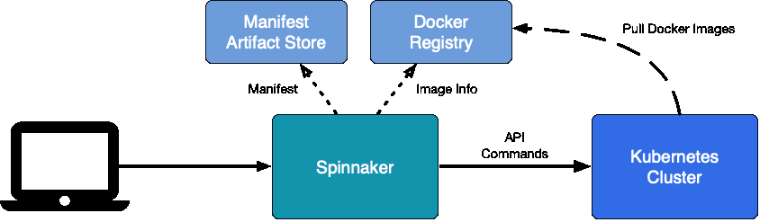
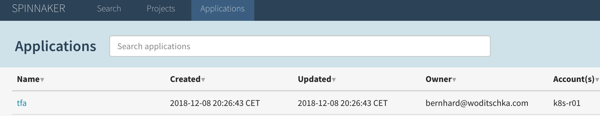
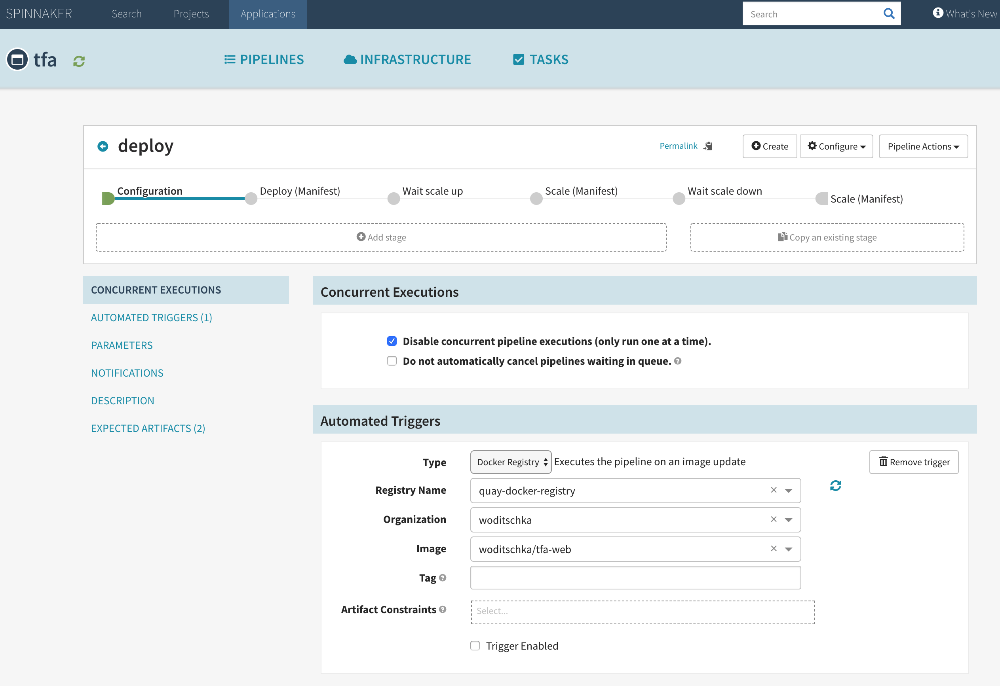
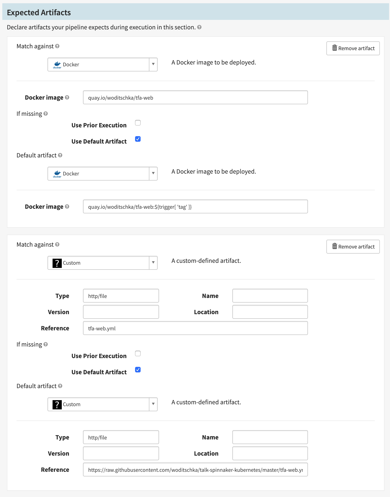
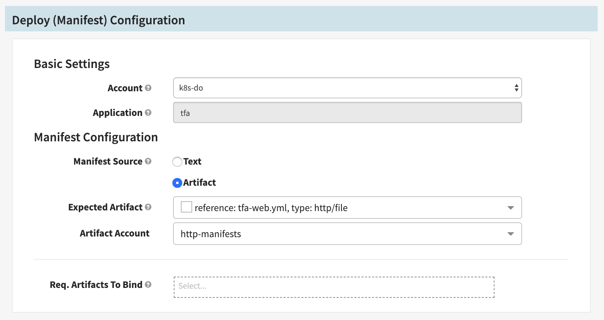
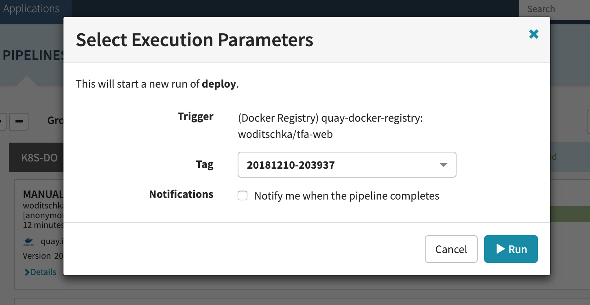
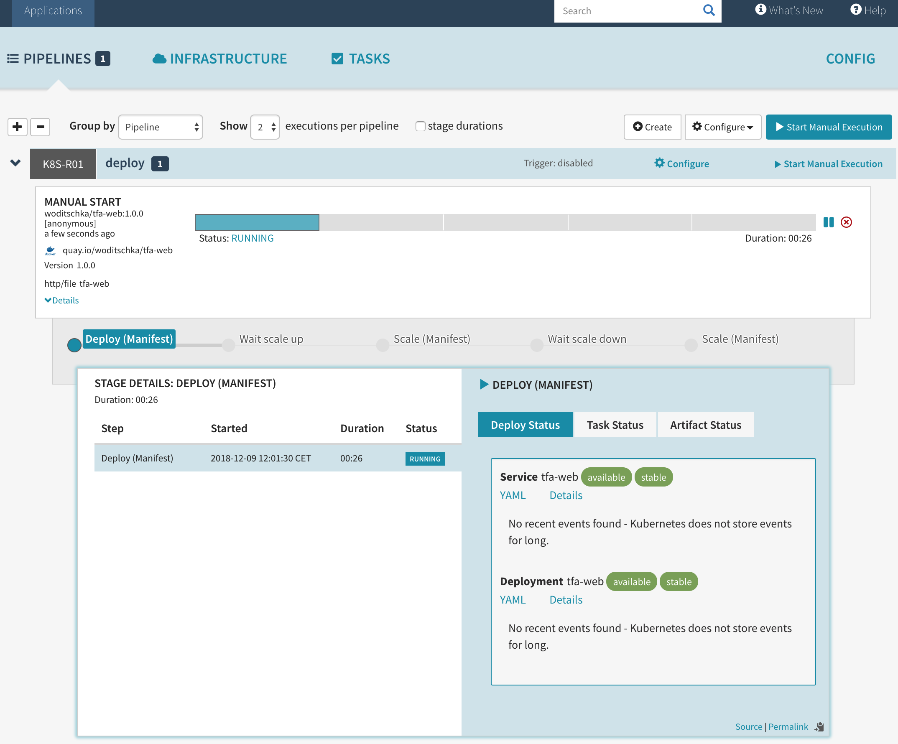
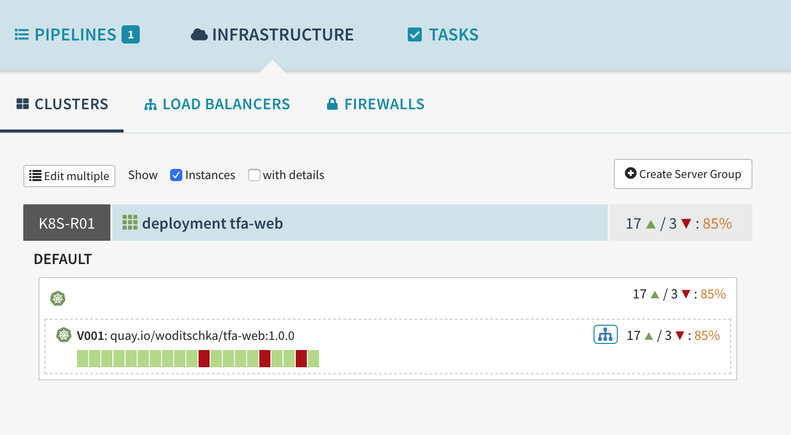
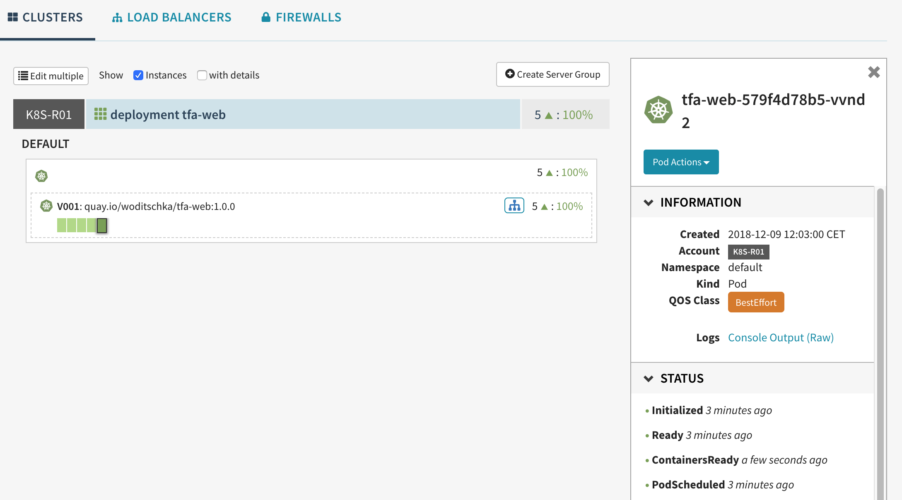
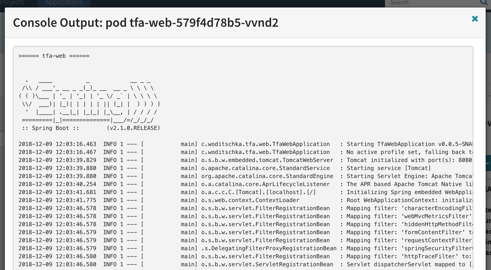

# CICD Pipeline with Spinnaker and Kubernetes

Talk @ Cloud Native Computing Meetup - Vienna, Austria 2018

## What is Spinnaker

[https://www.spinnaker.io](https://www.spinnaker.io)

"Spinnaker is an open source, multi-cloud continuous delivery platform for releasing software changes with high velocity and confidence"

### Features

Spinnaker provides two core sets of features:
- [application deployment](https://www.spinnaker.io/concepts/#application-deployment) - construct and manage continuous delivery workflows
- [application management](https://www.spinnaker.io/concepts/#application-management) - view and manage cloud resources.

### Multi-Cloud

Spinnaker supports to deploy to multiple cloud providers

- AWS EC2
- Kubernetes
- Google Compute Engine
- Google Kubernetes Engine
- Google App Engine
- Microsoft Azure
- Openstack

### Pipelines

Spinnaker allows to automate releases with pipelines triggered by

- git events
- Jenkins
- Travis CI
- Docker
- CRON
- other Spinnaker pipelines

that 

- run tests (integration and system)
- spin up and down server groups (e.g. containers)
- orchestrate rollout withs policies like blue/green, rolling update and canary
- monitor rolouts

## Resources

The Projectsite ([spinnaker.io](spinnaker.io)) provides great documentation about installation, operation ad use of Spinnaker.
Here are some links that I find useful to get started: 

- [Continuous Delivery With Spinnaker (free ebook)](https://www.spinnaker.io/publications/ebook)
- [Install and Configure Spinnaker](https://www.spinnaker.io/setup/install)
- [Presentations and Videos](https://www.spinnaker.io/publications/presentations)
- [Articles](https://www.spinnaker.io/publications/articles)
 

# Use Spinnaker



We will create a simple pipeline that deploys a simple web application 
- from a Docker Registry (quay.io/woditschka/tfa-web)
- with deployment artifacts ([tfa-web.yml](tfa-web.yml) - on this github repository)
- to a Kubernetes cluster 
- scale the deployment up and down

In this simple installation Spinnaker is not exposed to the Internet due to the fact that https and authentication is not configured, 
so we use ssh port forwaring to access the Spinnaker server on [http://localhost:9000](http://localhost:9000).

```
ssh -L8084:127.0.0.1:8084 -L9000:127.0.0.1:9000 -L9001:127.0.0.1:9001 root@<spinnaker-server>
```

## Create the application

Use Actions > Create Application to create the 'tfa' Applicaton 
- Name: tfa
- email: <your-email>
- Instance Port : 8080




## Create the pipeline

Use Pipelines > Create 
- Pipeline Name: deploy

#### Configure the Docker-Registry trigger



#### Configure the Expected Artifacts



#### Configure manifest deployment



## Start the deployment





## View the deployed Application

Use Infrastructure > Clusters to view the Application



To see more detail select a instance:



To see the logs of the pod select 'Console Output'



   
# Install Spinnaker 

This demo will executed on servers running on [https://cloud.digitalocean.com](https://cloud.digitalocean.com):

- Kubernetes 1.12 ckuster
- Spinnaker controlling the Kubernetes cluster 
 
## Kubernetes Cluster on Digital Ocean

Digital Ocean provides manages clusters you can soin up in a few mintes:

[https://cloud.digitalocean.com/kubernetes](https://cloud.digitalocean.com/kubernetes)

Follow the Instuctions on the website to ceeate and access the cluster.

#### install kubernetes dashboard

[https://kubernetes.io/docs/tasks/access-application-cluster/web-ui-dashboard/](https://kubernetes.io/docs/tasks/access-application-cluster/web-ui-dashboard/)
```
kubectl create -f https://raw.githubusercontent.com/kubernetes/dashboard/master/src/deploy/recommended/kubernetes-dashboard.yaml
```

#### create kubernetes dashboard user
```
kubectl apply -f ./dashboard-admin.yaml
```
#### show  kubernetes dashboard user token
```
kubectl -n kube-system describe secret $(kubectl -n kube-system get secret | grep admin-user | awk '{print $1}')
```

#### Add spinnaker serviceaccount
```
kubectl apply -f ./spinnaker-service-account.yaml
```

#### Set spinnaker serviceaccount permissions
```
kubectl create clusterrolebinding --user system:serviceaccount:default:spinnaker-service-account spinnaker --clusterrole edit
```

#### Get spinnaker serviceaccount secret
```
SERVICE_ACCOUNT_TOKEN=`kubectl get serviceaccounts spinnaker-service-account -o jsonpath='{.secrets[0].name}'`
kubectl get secret $SERVICE_ACCOUNT_TOKEN -o jsonpath='{.data.token}' | base64 --decode
```

## Spinnaker Server (localdebian)

On a fresh instance of Ubuntu 16.04 from [https://cloud.digitalocean.com](https://cloud.digitalocean.com)

### Install Firewall
```
ufw status
ufw default deny incoming
ufw default allow outgoing
ufw allow ssh
ufw --force enable
```

### Update system
```
apt -y update
apt -y upgrade
apt -y autoremove
```

### Install Halyard CLI

Halyard is the CLI to configure and deploy Spinnaker.

#### Add halyard user
```
useradd -m -d /home/halyard halyard
echo '%halyard ALL=(ALL) NOPASSWD: ALL' >> /etc/sudoers
```

#### Install halyard

```
wget https://raw.githubusercontent.com/spinnaker/halyard/master/install/debian/InstallHalyard.sh
chmod +x InstallHalyard.sh
./InstallHalyard.sh --user halyard -y
```

### Install Kubernetes CLI

```
apt install -y apt-transport-https
curl -s https://packages.cloud.google.com/apt/doc/apt-key.gpg | sudo apt-key add -
echo "deb https://apt.kubernetes.io/ kubernetes-xenial main" | sudo tee -a /etc/apt/sources.list.d/kubernetes.list
apt update
apt install -y kubectl
```

### minio - local S3 server

In this demo Spinnaker uses S3 to store it's configuration. We use [https://www.minio.io](https://www.minio.io) to set up a local S3 server running on Docker.

#### Install Docker

[https://docs.docker.com/installation/ubuntulinux](https://docs.docker.com/installation/ubuntulinux)

```
wget -qO- https://get.docker.com/ | sh
```

#### Install minio

```
mkdir -p /opt/docker/minio/data
mkdir -p /opt/docker/minio/config
chmod -R uga+rwX /opt/docker

docker run -d --restart=always --name minio -p 127.0.0.1:9001:9000 -e MINIO_ACCESS_KEY='spinnaker' -e MINIO_SECRET_KEY='spinnaker' -v '/opt/docker/minio/data:/data' -v '/opt/docker/minio/config:/root/.minio' minio/minio server /data
```

### Install and start Redis
```
apt install -y redis-server
apt install -y redis-tools
systemctl start redis
```

### Configure and deploy Spinnaker

Change to halyard linux user
```
su halyard
cd /home/halyard/
```

#### Configure Kubernetes access config

```
mkdir cd /home/halyard/.kube
```

Copy the Kubernetes config to ```/home/halyard/.kube/config```

```
hal config deploy edit config--type localdebian
hal config version edit --version 1.11.0
hal config edit --timezone 'Europe/Vienna'
```

#### Docker registry access
```
echo <access-key> | hal config provider docker-registry account add quay-docker-registry --address quay.io --username '<username>' --password
hal config provider docker-registry enable
```

#### Kubernetes cluster access
```
hal config provider kubernetes account add k8s-r01 --context k8s-r01 --provider-version v2 --docker-registries quay-docker-registry
hal config provider kubernetes enable
```
#### S3 storage
```
mkdir -p /home/halyard/.hal/default/profiles
cat >/home/halyard/.hal/default/profiles/front50-local.yml <<'EOL'
spinnaker.s3.versioning: false
EOL

echo 'spinnaker' | hal config storage s3 edit --endpoint http://127.0.0.1:9001 --region us-east-1 --access-key-id 'spinnaker' --bucket 'spinnaker' --secret-access-key
hal config storage edit --type s3
```

#### Artifact - http
```
hal config features edit --artifacts true
hal config artifact http enable
hal config artifact http account add http-manifests
```

#### enable gate (api) access
```
mkdir -p /home/halyard/.hal/default/service-settings
cat >/home/halyard/.hal/default/service-settings/gate.yml <<'EOL'
host: 127.0.0.1
EOL
```

#### enable deck (ui) access
```
mkdir -p /home/halyard/.hal/default/service-settings
cat > /home/halyard/.hal/default/service-settings/deck.yml <<'EOL'
host: 127.0.0.1
EOL
```

#### deploy spinnaker

```
sudo hal deploy apply --flush-infrastructure-caches
```

#### enable services 
```
sudo systemctl enable gate
sudo systemctl enable orca
sudo systemctl enable igor
sudo systemctl enable front50
sudo systemctl enable echo
sudo systemctl enable clouddriver
sudo systemctl enable rosco
```
